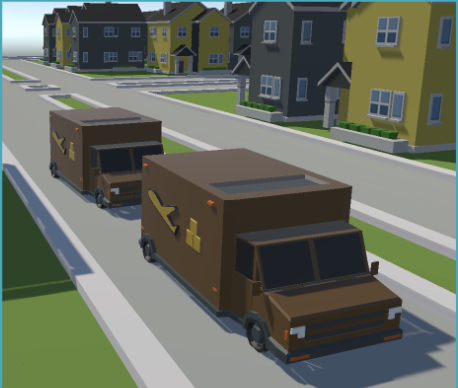

# Multiagents Delivery Service Optimization and Simulation

## 

## Description

---

This project simulates through a multi-agent based model the optimization of a package delivery service. 

The objective is to improve the efficiency in time per package-delivery and optimize the routes that delivery cars follow in order to have an efficient gasoline and car usage.

The simulation's agent-based model is constructed in Python with the Mesa framework and its output data is graphically represented with an application built in Unity. 

The world where the delivery of packages occurs is logically represented with a directed and weighted graph on which the simulation's optimizing algorithm, illustrated by the Travelling Salesman Person problem (the efficient delivery of multiple packages, in multiple sites within a single tour by a courier), is run. The algorithm is built guided by the probabilistic algorithmic technique Simulated Annealing (SA) and is aided by Dijkstra's algorithm. 

The weights of the graph's edges change semi-randomly through the program, to imitate the existence of variable traffic that is unpredictable but also follows discernible patterns. 

The algorithm seeks the global optimum, that is, the minimal distance travelled in a tour by a courier, and has in relation to SA, variable parameters with predefined initial values: 
- Initial temperature: 10e100
- Cooling factor: 0.90
- Number of restarts: 1

The Unity application obtains the simulation's output data by means of a simple FLASK API, through which its duration, number of delivery vehicles, capacity of vehicles, and whether the simulation is or not optimized, can be defined as parameters. 

---

## Agents

---

### **Delivery Service(Model)**

The mail office is the model and operates as a super agent and is aware of the houses present in the simulation, the packages needed to be delivered (including delivery information) and the capacity of packages each car can deliver.

The mail office selects the packages to deliver on each car based on delivery locations closeness and through simulated annealing traces an efficient route for the delivery cars to follow.

As seen in the image below, the model includes a city that consists of 108 houses distributed in 9 blocks and 3 zip code areas, were each street has its own name and every house has its own house number.

States:

- grid
- grid_width
- grid_height
- mesa_grid
- sim_activation
- map
- dispatch_coord
- dispatch_street
- dispatch_direction
- package_rate
- optimized
- traffic_manager
- package_admin
- sim_data
- num_steps
- place_houses
- deliveryCars

Perceptions:

- Houses present in the simulation
- Delivery cars available
- Delivery cars packages capacity
- Delivery cars routes
- Package to deliver
- Streets
- Zip Zones
- House numbers
- House coordinates in the map

Actions:

- Smart selection of packages to deliver based on delivery locations closeness
- Creates delivery cars routes using simulated annealing.

---

### **House**

House agents simulate the creation of package orders at random times and contain within themselves unique information about their location in the simulation's world, analogous to addresses used in the operation of real-life delivery services.  

States:

- Coordinate (houseCoord)
- Zip code (zipNumber)
- Block (blockNumber)
- Street Address (streetAddress)
- House Number (houseNumber)

Perceptions:

- Ordered packages that must be delivered

Actions:

- House can create package orders at random times

---

### **Delivery Car**

Delivery cars are active agents within the model in that they independently initiate interactions with other agents, although are highly dependent on the delivery service model. When instantiated in the world and placed within the model's grid, they are assigned a group of packages (a localized selection is sought) and a queue of directions to follow at each intersection. When all directions are followed, the vehicle is guaranteed to have completed a successful tour, delivering all assigned packages. The queue of directions is the product of the previously mentioned optimizing algorithm that applies simulated annealing. As it moves through the world delivery cars examine house agents that are found in its immediate vicinity to determine whether or not they have found a target house, once they do, they momentarily stop its advance and remove from its cargo the corresponding package before proceeding with the tour; also, they determine at each step of the simulation, if the next space to advance onto is blocked by another fellow courier. Delivery cars have a fixed velocity and can operate indefinitely.  

States:

- Position: the planar position of the vehicle. 
- Capacity: the current number of additional packages the vehicle could hold. 
- Current direction: the alive direction the vehicle is following (north, south, east, or west). 
- Is delivering: whether or not the vehicle is in operation. 
- Directions: the discrete directions the vehicle will follow as it advances and that lead to its successful operation. 
- Packages: the collection of ongoing packages the vehicle is to deliver in its current tour. 

Perceptions:

- Delivery car agents examine their immediate surroundings as they advance in the simulation's world. They examine house agents they pass by, specifically, their address, and the position of fellow courier vehicles when close to them so as to prevent collisions. 

Actions:

- Delivery car agents are able to "deliver" packages when necessary, removing them from their list of those assigned by the delivery service model. 
- They advance at a fixed velocity, in a single discrete direction (north, south, west, or east), and follow the directions provided by the delivery service. 
- They can stifle their movement if their successive move would produce a collision with another vehicle. 

---

### **Field**

The field agent does not interact with it's environment based on perceived information.

It's a decorator that helps the graphical visualization of the program by coloring the field, so the streets and cars displayed in the simulation can be the main focus of attention.

States:

- color

---

## Interaction Between Agents of the same type

---

### **Car**

The car agent follows it's direction and turns in a random direction once it hits the crossroad. The only interactions it has with other car agents is noticing them to avoid a crash.

### **Traffic Light**

Traffic lights don't interact with each other directly. The are puppeteered by the crossroad model to operate traffic in each lane of the intersection.

---

## Environment

---

- **agents.py:** Agents implementation
- **model.py:** Super agent and model implementation
- **run.py:** launches de server
- **server.py:** Agents initialization and server settingd
- **.idea:** Data visualization

---

## Variables and parameters

---

The variables and parameters of the simulation can be adjusted from the graphical user interface of the visualization, which are:

- Number of cars
- Half Length(dimentions of map)
- Traffic timer
- Turning rate (Turning rate of cars)

---

## Simulation Process

---

The simulation process consists of running the run.py file, which launches the server and the server.py is the file that instantiates the intersection and the agents.

Then a link will appear on the terminal and the simulation would be visible on a web browser.

---

## Results

---

The traffic was optimized by making the lanes with more traffic a priority and allowing a traffic light change when there was no traffic in a lane and the traffic light color was green.

---

### Link to Repository: https://github.com/davidmartinezhi/Traffic-Intersection

---
