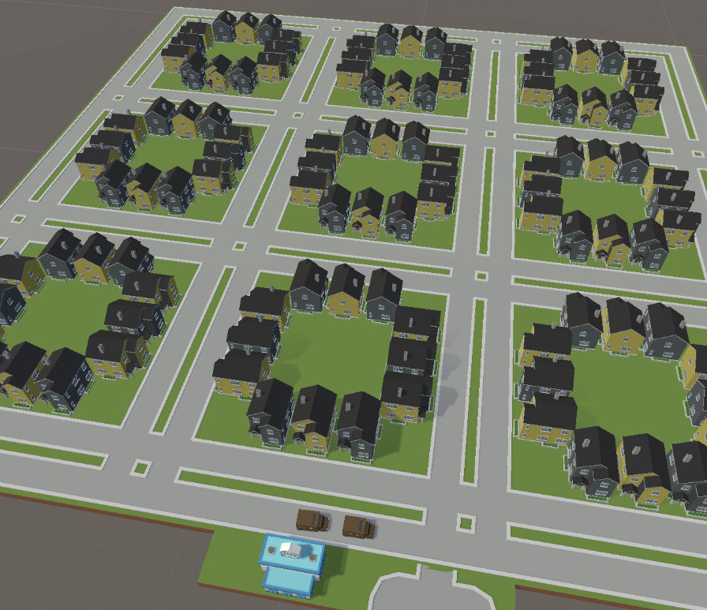
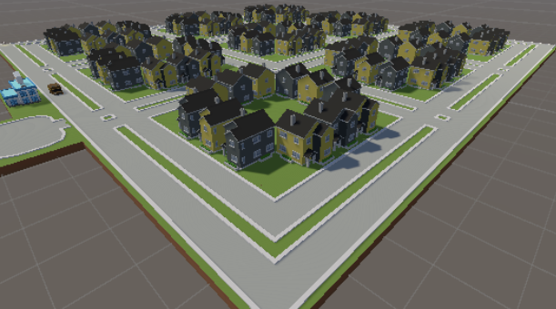
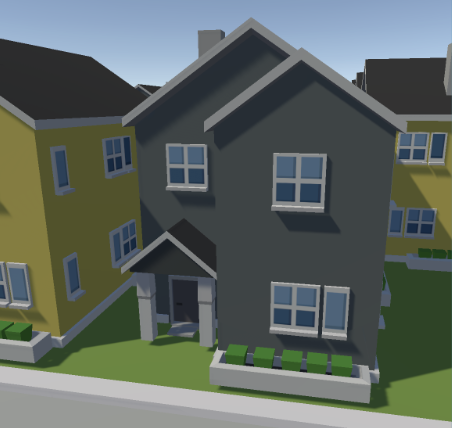

# Multiagents Delivery Service Optimization and Simulation

## 

## Description

---

This project simulates through multi-agents the delivery service optimization of a mail office through simulated annealing algorithm and smart package delivery.

The objective is to improve the efficiency in time per package-delivery and optimizing the routes that delivery cars follow in order to have an efficient gasoline and cars usage.

---

## Agents

---

### **Delivery Service(Model)**

The mail office is the model and operates as a super agent and is aware of the houses present in the simulation, the packages needed to be delivered (including delivery information) and the capacity of packages each car can deliver.

The mail office selects the packages to deliver on each car based on delivery locations closeness and through simulated annealing traces an efficient route for the delivery cars to follow.

As seen in the image below, the model includes a city that consists of 108 houses distributed in 9 blocks and 3 zip code areas, were each street has its own name and every house has its own house number.

States:

- Number of agents
- Running
- width
- height
- centre_bounds
- grid
- schedule
- traffic time
- no car zone (intersection point)
- centre
- possible turns
- traffic light time counter
- position of traffic lights
- traffic counter
- streets

Perceptions:

- Cars present in the simulation
- position of traffic lights
- traffic counter
- streets

Actions:

- Create cars and assign random color and directions
- Changes traffic lights color

---

### **House**

The house agents simulates the creation of package orders at random times and contains the information a real life house uses for delivery purposes.

States:

- Coordinate (houseCoord)
- Zip code (zipNumber)
- Block (blockNumber)
- Street Address (streetAddress)
- House Number (houseNumber)

Perceptions:

- Ordered packages that must be delivered

Actions:

- House can create package orders at random times

---

### **Traffic Light**

The perceptions and actions of the traffic light are managed by the Crossroad Model which operates as a super agent and manages all traffic lights base on the information it perceives in the traffic

States:

- color

---

### **Field**

The field agent does not interact with it's environment based on perceived information.

It's a decorator that helps the graphical visualization of the program by coloring the field, so the streets and cars displayed in the simulation can be the main focus of attention.

States:

- color

---

## Interaction Between Agents of the same type

---

### **Car**

The car agent follows it's direction and turns in a random direction once it hits the crossroad. The only interactions it has with other car agents is noticing them to avoid a crash.

### **Traffic Light**

Traffic lights don't interact with each other directly. The are puppeteered by the crossroad model to operate traffic in each lane of the intersection.

---

## Environment

---

- **agents.py:** Agents implementation
- **model.py:** Super agent and model implementation
- **run.py:** launches de server
- **server.py:** Agents initialization and server settingd
- **.idea:** Data visualization

---

## Variables and parameters

---

The variables and parameters of the simulation can be adjusted from the graphical user interface of the visualization, which are:

- Number of cars
- Half Length(dimentions of map)
- Traffic timer
- Turning rate (Turning rate of cars)

---

## Simulation Process

---

The simulation process consists of running the run.py file, which launches the server and the server.py is the file that instantiates the intersection and the agents.

Then a link will appear on the terminal and the simulation would be visible on a web browser.

---

## Results

---

The traffic was optimized by making the lanes with more traffic a priority and allowing a traffic light change when there was no traffic in a lane and the traffic light color was green.

---

### Link to Repository: https://github.com/davidmartinezhi/Traffic-Intersection

---
